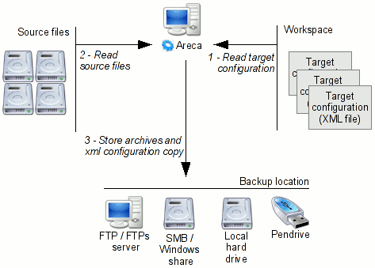

# Areca Backup - User's Manual

| About Areca                   | End user documentation            | Technical informations                        |
|-------------------------------|-----------------------------------|-----------------------------------------------|
| [Home](README.md)             | [Plugins](plugin_list.md)         | [Regular expressions](regex.md)               |
| [Features](features.md)       | [Versions history](history.md)    | [Translations](documentation.md#translations) |
| [Plugins](plugin_list.md)     | [Tutorial](tutorial.md)           | [Config backup](config_backup.md)             |
| [Screenshots](screenshots.md) | [User's manual](documentation.md) |                                               |
| [Download]                    | [FAQ](faq.md)                     |                                               |
| [Bug & feature requests]      | [Support & Contact](support.md)   |                                               |
| [Forums]                      |                                   |                                               |

[Download]: https://sourceforge.net/projects/areca/files/areca-stable/
[Bug & feature requests]: https://sourceforge.net/p/areca/_list/tickets?source=navbar
[Forums]: https://sourceforge.net/projects/areca/forums


> Areca comes with a graphical user interface and a command-line interface.
>
> It offers many features such as incremental backups, encryption and email reports.


## What is Areca ?

\[[top](#areca-backup---users-manual)\]

---

Areca is a file backup software which can be run on Windows or Linux. It creates backup copies (which can be encrypted and compressed) of your files and stores them on external drives, pendrives, FTP servers, ...

Areca is also able to trigger additional actions, like storing a backup report on your hard drive, sending it by email, launching shell scripts before or after your backup.

Areca supports incremental, differential and full backups.




### What is NOT Areca ?

Areca is not a disk-ghosting application (such as Norton Ghost or Symantec Ghost) : it won't be able to create an image of your disk partitions (mainly because some files will be locked by your system).


### Why use Areca ?

Areca is easy to use : once you have defined your backup's parameters, they can be launched by a simple click.

Areca also provides all tools needed to handle your archives :

- Backup
- Archive recovery (with or without deleted files) : entire archives or single files can be easily recovered
- Archive merge : contiguous incremental archives can be merged into a single archive to save storage space
- Archive deletion
- History explorer : different versions of a given file can be browsed and restored
- Archive explorer : files can be searched among your archives

In addition, both a Graphical User Interface (useful for general administration tasks) and a Command-Line interface (which can be use with a task scheduling software) are provided.


### User interfaces

#### GUI

This is the main interface of Areca. It is launched by the "areca.exe" (Windows) or "areca.sh" (Linux) executable.

It provides all the facilities needed to define which sets of files / directories will be stored (These sets are named "Targets" in Areca's terminology), where and how they will be stored.

It can also be used to explore your archives, search and recover files, explore a specific file's history ...

[[Go to "Using the GUI"](#using-the-graphical-user-interface)]


#### Command-Line interface

This interface can be used to launch the backups that have been defined in the graphical user interface ("Targets"). It can be easily integrated into a scheduling software, like Windows' task scheduler or Crontab (on Linux).

It can also be used to recover your archives after a disk crash.

[[Go to "Using the Command-Line Interface"](#using-the-command-line-interface)]


### How to install Areca ?

\[[top](#areca-backup---users-manual)\]


#### Pre requisites

Areca is written in Java, which means that you need to have a suitable Java Virtual Machine (JVM) installed on your computer : Areca requires a JVM v1.4 or higher.

Most operating systems come with a pre-installed Java Virtual Machine. If you don't know whether you have such a thing, simply open a Command-Prompt and type "java -version" or "java --version" : you should have something like :

```log
java version "1.6.0_03"

Java(TM) SE Runtime Environment (build 1.6.0_03-b05)
```

If it is not the case, go to Sun Microsystems' web site (http://java.sun.com/javase/downloads/index.jsp) and download the latest JVM available for your operating system.


There are no other prerequisites.


#### Windows

Areca has been tested for Windows 2000, XP and Vista.

To install Areca on Windows, download the latest release on Areca's website (http://sourceforge.net/project/showfiles.php?group_id=171505) and run the setup. This will create a new program group named "Areca".

To launch Areca :

- Use "areca.exe" for the graphical user interface (default)
- Use "areca_cl.exe" for the command-line interface


#### Linux

To install Areca on Linux, download the latest release on Areca's website (http://sourceforge.net/project/showfiles.php?group_id=171505) and unzip its content on your disk.

To make Areca executable, run the following commands :

```bash
chmod a+x areca.sh check_version.sh
chmod a+x -v bin/*
```

To launch Areca :

- Use "./areca.sh" for the graphical user interface (default)
- Use "./bin/run_tui.exe" for the command-line interface


#### Other systems

Althought Areca has not been packaged for other operating systems, there is no reason why it could not be run on them (MaxOS for instance). The only prerequisite is to provided the necessary SWT libraries (https://www.eclipse.org/swt/)


#### Memory settings

Areca allocates up to 512 Mbytes. If you want to allocate more memory (if you are running targets that handle a big number of files), you may want to increase this amount.

On Linux, this value can be modified by editing the startup scripts (/bin/run_gui.sh and /bin/run_tui.sh) and setting the "Xms" (memory allocated on startup) and "Xmx" (upper memory limit) parameters.


On Windows, it depends on the version of Areca you are using :

Before Areca 7.2.6, two arguments can be passed to areca.exe and areca_cl.exe :

- "-Jmaxheap" : Defines the maximum amount of memory which can be used by Areca. For instance : areca.exe -Jmaxheap=256M will allow Areca to allocate up to 256 MBytes of memory.
- "-Jinitialheap" : Defines the initial amount of memory which is allocated by Areca on startup. For instance : areca.exe -Jinitialheap=128M will allocate 128 MBytes.


From Areca 7.2.6, the "Xms" (memory allocated on startup) and "Xmx" (upper memory limit) parameters can be set by modifying the areca.l4j.ini and areca_cl.l4j.ini files that are located in Areca's directory.


#### Tuning Areca's technical configuration

Areca's technical configuration is stored in the "fwk.properties" file (located in the "/config" directory). BE VERY CAREFUL when editing this file, and be sure you have a good understanding of what you are doing.


#### Checking new versions

You can configure Areca (see the "Preferences" window) to check whether there is a new version available on startup. You can also check it manually by running the "Check new version" item in the "Help" menu.

You can also run the "check_version.exe" executable (check_version.sh on Linux)


### Basic concepts

\[[top](#areca-backup---users-manual)\]


#### Storage modes

Areca can handle multiple storage modes :

- Standard : It is the default mode, which is recommended for most users : If you choose this storage mode, a new archive will be created for each backup. All new or modified files since the last backup will be stored in this archive.
- Delta : This mode is recommended for advanced users : If you choose this storage mode, a new archive will be created for each backup. All modified *parts* of files since the last backup will be stored in this archive. This mode is particularly useful if you are handling large files. (Areca uses an algorithm which is similar to rsync to detect and handle modified parts of your files)
- Image : If you choose this storage mode, a unique archive will be created and updated at each backup.


#### Backup types

Areca can handle the following types of backups :

- Full Backup : When a full backup is performed, ALL files are stored in your archive (whether they have been modified or not).
- Incremental backup : When an incremental backup is performed, only the files which have been modified since the last backup are stored in your archive.
- Differential backup : When a differentiel backup is performed, only the files which have been modified since the last FULL backup are stored in your archive.

Areca uses the file's size and last modification time to detect modified files. If one of these attributes is modified (whatever its value is), the file is flagged as modified. This allows a fast detection of modified files.


#### Target

A backup task is called "Target" in Areca's terminology. It defines which files will be stored (sources), where they will be stored (destination) how they will be stored (whether they will be compressed, encrypted, ...)

For instance, you may configure a target to backup the "C:\MyDocuments\Accounting" and "C:\MyDocuments\Account\Photos" source directories on "E:\backups" (assuming that "E:\" is an external hard drive), using Zip compression.


#### Target Groups

Targets can be organized in "Target groups", for instance "Personal documents", "MP3", "Emails", ... (it is possible to launch a backup on a whole group)


### Target settings

\[[top](#areca-backup---users-manual)\]

---


#### Sources

Sources define which files or directory will be stored in your archives. Multiple sources can be set.


#### Destination

Destination define WHERE your archives will be stored :

- File system (including network directory, external hard drive, USB key, ...) : Areca will store your archives on the file system
- FTP : Areca will store your archives directly on a FTP (or FTPs) server.


#### Compression

If archive compression is chosen, a zip file is built at each backup instead of a standard directory. Two archive formats are available :

- Zip : Standard Zip format, readable by most archivers, which limits zip file size to 4 GB. So standard zip compression WON'T WORK for bigger archives. It is advised to keep a safety margin and not to use this format for archives bigger than 1GB (so your archives will still be OK if your data happen to grow up to 4 GB in the future)
- Zip64 : This format is able to deal with archives over 4 GB. Zip64 archives are readable by all compatible archivers (including WinZip and - of course - Areca)

You can either :

- Compress each file separately : in this case, a zip file will be created for each source file.
- Store all files in a unique archive : in this case, a unique zip archive will be created for each archive (containing all source files)

You can also mention a comment which will be included in your zip files, set the charset which will be used to store your file names within the archive or set a "split size", which will produce split archives.


#### Encryption

Archive encryption means that the archive written on your backup location will be encrypted : instead of creating standard zip files or directories, Areca will create AES128 or AES256 encrypted files, so that the only way to read these archives will be to use Areca with the correct decryption key.

As this encryption key is stored in the backup target, you will never be prompted for it again : Areca will transparently use it to encrypt / decrypt these archives


This feature is useful when your backups are stored on a shared disk, or at a location to which other peoples may access (a remote server, for instance), or that can be easily lost or stolen (USB keys, for instance). In these cases, encrypted archives will guarantee that other persons won't be able to read your archives if they get access to the storage location.

You can check that Areca has encrypted your archives by simply trying to open an archive with Window's explorer (or WinZip if they are compressed) : you will get an error.


The encryption key is either

- generated from the passphrase entered by the user, using the PBKDF2 key derivation function
- or set directly in the configuration (hexadecimal format)

If a passphrase is used, Areca will add some additional characters (which can be configured in areca.properties under the "encryption.keygen.salt" key) before generating the encryption key. The number of PBKDF2 iterations (about 100 000 by default) is configurable in the same file, under the "encryption.keygen.iterations" key.


#### Files management

You can also tune the target's file management policy (for instance whether file permissions will be stored or not - Linux only)

In case of "Image" targets, the following backup modes are available :

- Not compressed or compression by file : Incremental (the existing archive is updated by synchronizing the changed files only) or Full (the existing archive is updated by synchronizing ALL files)
- Compressed (Single Zip archive) : Full only (it is not possible to update the existing zip archive in an incremental way)

In case of "Non Image" target, the following backup modes are available :

- Not compressed or compression by file : Incremental (a new archive is created with the changed files only), Differential (a new archive is created with the modified files since the last full backup only) or Full (a new archive is created with all files)
- Compressed (Single Zip archive) : Incremental, Differential or Full

Note that "Incremental backups" have a sense even in the case of an "image" backup : they allow to reduce the number of updated files (useful if you store your data across a network)


#### File filters

A target also defines whether all files will be stored or if some of them will be filtered. This is achieved by defining a set of "File filters", which can be combined to include or exclude some specific files, based on various criteria (size, name, extension, ...)

They can thus be used to define more precisely the scope of processed files.


The following filters are available :

- File extension filters : The files are filtered according to their extension : *.tmp, *.exe, *.dll ... (Useful to include / exclude predefined types of files from the backup.)
- Regex filters : The files are filtered according to a regular expression.
- Directory filters : Useful to include / exclude predefined directories from the backup.
- File size filters
- File date filters
- Symbolic links filters (to exclude symbolic links from backup - useful on Linux systems)
- Locked files filters (to excludes files which are locked by the system or files you can't access)

Filters are modeled as a tree in Areca. Each node of the tree is either :

- A single filter (for instance a "Regex" archive filter")
- A composite filter (modeled as a "subtree" of the main tree)

Each filter can work in two modes :

- "Inclusion" mode : The files are stored ONLY IF they match the condition
- "Exclusion" mode : The files are stored ONLY IF they don't match the condition

A "Composite" filter accepts an additional "OPERATOR" parameter :

- "AND" : The files must match ALL subfilters
- "OR" : The files must match AT LEAST ONE of the subfilters

Some examples :

_"Store all files except those who are located in directories "c:\toto" and "c:\titi""_

```
+ Filter Group (EXCLUSION, OR)
    -> Subfilter : Directory filter (c:\toto, INCLUSION)
    -> Subfilter : Directory filter (c:\titi, INCLUSION)
```

Another solution :

```
+ Filter Group (INCLUSION, AND)
    -> Subfilter : Directory filter (c:\toto, EXCLUSION)
    -> Subfilter : Directory filter (c:\titi, EXCLUSION)
```

_"Store all files except those who's located in the "c:\tutu" directory and those whose size is above 10 MB or bellow 1 MB"_

```
+ Filter Group (INCLUSION, AND)
    -> Subfilter : Directory filter (c:\tutu, EXCLUSION)
    -> Filter Group (EXCLUSION, OR)
        -> Subfilter : Size filter (> 10 MB, INCLUSION)
        -> Subfilter : Size filter (< 1 MB, INCLUSION)
```

To write your filters, always keep in mind the following logical rules :

```
NOT (A OR B) = (NOT A) AND (NOT B)
NOT (A AND B) = (NOT A) OR (NOT B)
```


#### Pre/Post processing

You can ask Areca to do the following things before or after backup :

- Store a report on disk : A backup report is generated by Areca and stored as a text file on your disk
- Send a report by email : A backup report is generated by Areca and sent by email
- Execute a script : A shell script is launched by Areca
- Merge archives : Merge a set of archives into a single archive. The merged archives can be either all archives older than a specific date, or all archives that have been produced during a specific time frame.


#### Configuration storage (xml files)

The target configuration is stored in a XML file (one file per target group). These files can be edited directly (without using the graphical user interface), but such modifications must be done CAREFULY.

XML configuration files are stored in "workspaces". The default workspace is stored in the "/config" subdirectory of Areca's main directory.


### Archive management

\[[top](#areca-backup---users-manual)\]


#### Backup

Areca's basic function : Launch the backup process and store the source files and directories accordingly to the target's storage policy and file filters. As a result, an archive is created on the backup location (external hard drive, FTP server, USB key, ...)


#### Backup simulation

Launch a backup in "simulation" mode : no archives will be created; Areca will simply list the files/directory that should have been stored. Useful to check the target configuration (filters for instance) or estimate the size of the next archive.


#### Recovery

Recovery will be discussed in detail in the "[How to recover](#how-to-recover)" section.


#### Merge

This command allows to merge contiguous incremental archives (between a date D1 and another date D2) into one single archive (which will be considered to be an archive at date D2). The merge process implies that all the history between D1 and D2 is lost : this includes files modifications (if multiple versions of a file exist between D1 and D2, only the latest is kept) and file deletions (if a file has been modified and removed between D1 and D2, all versions between D1 and D2 are removed from the archives)

"Archive merges" are the answer to the increasing archive size : it allows you to control the history which is kept in your archives.

Additional informations about archive merging can be found on [Areca's wiki](../sourceforge.net/technical-notes-on-archive-merging.md)


#### Deletion

Delete a set of archives


### Using the graphical user interface

\[[top](#areca-backup---users-manual)\]

---


#### Launching Areca

Launch command :

- Windows : areca.exe
- Linux : areca.sh or bin/run_gui.sh [<workspace_path>]

Where <workspace_path> denotes the default workspace directory which will be loaded on startup (for instance c:\areca\config)


#### Physical view

The "physical view" lists the archives that have been created by this target. These archives are sorted by dates (most recent archives on the top). This view is useful to have an overall view over the archives stored on the backup location.

Merges and recoveries can be launched from this screen.

The properties and detailed content of each archive can be browsed (double-click on a specific archive)


#### Logical view

The "logical view" gives a consolidated view over all files and directories contained in your archives. It also displays the history of each file (creations, modifications, deletions)


### Using the command-line interface

\[[top](#areca-backup---users-manual)\]

---

The command-line interface is useful when you want to schedule your backups. The general syntax is as follows :

On linux :

```bash
./bin/run_tui.sh <command> <options>
```

On Windows :

```cmd
areca_cl.exe <command> <options>
```


#### Description

Display a textual description of a target group.

Syntax :

```
describe -config <your xml config file>
```

Example :

```
c:\areca\bin\areca_cl describe -config c:\areca\config\myconfig.xml
```


#### Backup

Launch a backup on a target or a group of targets.

Syntax :

```
backup -config <your xml config file> [-target <specific target>] [-f] [-d] [-c] [-s] [-title <archive title>]
```


If the "f" option is set, Areca will perform a full backup. (instead of an incremental backup)

If the "d" option is set, Areca will perform a differential backup. (instead of an incremental backup)

If the "c" option is set, Areca will check the archive consistency after backup.

If the "s" option is set and backup is performed on a target group, Areca will handle the group's targets sequentially


Examples :

```
c:\areca\bin\areca_cl backup -config c:\areca\config\myconfig.xml
c:\areca\bin\areca_cl backup -config c:\areca\config\myconfig.xml -target 1 -d
```


#### Merge

Merge a set of archives into a single archive. The merged archives can be either all archives older than a specific date, or all archives that have been produced during a specific time frame.
Possible syntaxes :

```
merge -config <your xml config file> -target <specific target> [-k] -date <recovery date : YYYY-MM-DD> [-title <archive title>]
merge -config <your xml config file> -target <specific target> [-k] -from <nr of days> -to <nr of days> [-title <archive title>]
```

If the "k" option is set, all deleted files will be kept in the merged archive. They will be destroyed otherwise.


Examples :

```
c:\areca\bin\areca_cl merge -config c:\areca\config\myconfig.xml -target 1 -date 2005-07-17
c:\areca\bin\areca_cl merge -config c:\areca\config\myconfig.xml -target 1 -from 14 -to 7
c:\areca\bin\areca_cl merge -config c:\areca\config\myconfig.xml -target 1 -k -from 10 -to 5
```


#### Deletion

Delete a set of archives that are younger than a specific date or delay.

Possible syntaxes :

```
delete -config <your xml config file> -target <specific target> -date <recovery date : YYYY-MM-DD>
delete -config <your xml config file> -target <specific target> -delay <nr of days>
```

Examples :

```
c:\areca\bin\areca_cl delete -config c:\areca\config\myconfig.xml -target 1 -date 2005-07-17
c:\areca\bin\areca_cl delete -config c:\areca\config\myconfig.xml -target 1 -delay 10
```


#### Recovery

Recover a set of archives at a specific location.

Syntax :

```
recover -config <your xml config file> -target <specific target> -destination <destination folder> -date <recovery date : YYYY-MM-DD> [-c]
```

If the "c" option is set, Areca will verify that the recovered files are identical to the original ones.


Example :

```
c:\areca\bin\areca_cl recover -config c:\areca\config\myconfig.xml -target 1 -destination c:\tmp -date 2005-07-17 -c
```


#### Check

Check that the files contained in an archive are identical to the original ones.

Syntax :

```
check -config <your xml config file> -target <specific target> [-destination <destination folder>] [-date <checked date : YYYY-MM-DD>] [-a]
```

If the "a" option is set, Areca will check all archives created until the date passed as argument. It will only check the last archive otherwise.


Example :

```
c:\areca\bin\areca_cl check -config c:\areca\config\myconfig.xml -target 1 -date 2005-07-17 -a
```


#### Using the wizards

Two wizards are available in the graphical user interface : A "backup shortcut" wizard, which will simply help you to generate a backup command in the form of a .bat file (or a .sh file on Linux) and a "backup strategy" wizard, that will help you to generate a set of backup commands that implement a defined strategy.


##### "Backup shortcut" :

The wizard will ask you :

- Where the backup shortcut will be generated
- Whether an incremental, differential or full backup will be performed
- Whether only the select group or target group will be processed or the whole workspace

Once these informations are set, Areca will generate the backup shortcut at the requested place.


##### "Backup strategy" :

The wizard will ask you :

- Where the backup shortcuts will be generated
- A set of parameters of the following form : "One archive every X days, Y times"

Once these informations are set, Areca will generate a set of backup shortcuts at the requested place. Once properly scheduled, these shortcuts implement a strategy that allows you to define the "history depth" that Areca will keep at the backup location.


Example :

With the following parameters :

- One archive every 1 day, 7 times
- Then, one archive every 7 days, 3 times
- Then, one archive every 28 days, 5 times

Areca will keep :

- All daily archives of the last 7 days
- A weekly archive between the last week (7 days) and the last 4 weeks
- A monthly archive between the last month (4 weeks) and the last 6 months
- A single archive over 6 months


### How to recover

\[[top](#areca-backup---users-manual)\]

---

There are multiple situations in which you will need to recover lost files : accidental directory deletion, accidental file deletion or modification, disk crash, full system crash, ...

Areca provides multiple recovery modes that should cover these needs.


#### Case 1 - Recovering an entire archive

This is the standard recovery case : all your files have been lost or corrupted and you want to restore them.

This can be done :

- With the graphical user interface : simply go to the "Physical view" (archive list), right-click at the required restore-point and choose "Recover" : Areca will recover the selected archive and all previous archives.
- With the command-line interface : use the "recover" command (see "[Using The Command-Line Interface](#using-the-command-line-interface)" for the detailed syntax)


#### Case 2 - Recovering a single file or subdirectory

You may want to do this when a subdirectory or a file is accidentally destroyed, corrupted or modified.

This can be done from the "Logical view", in the graphical user interface : Simply select the item (file or directory) that you want to restore, right-click and select "Recover".


For security reasons, Areca will NEVER recover your data at the original location in cases 1 and 2. (they will be systematically recovered in a subdirectory named "recovered_data") It is up to you to move these data at their final destination.


#### Case 3 - Recovering a specific version of a file

This may be useful when the file has been accidentally modified and stored : In this case, the last backuped version is not correct and you may want to recover one of the previous versions.

This can be done from the "Logical view", in the graphical user interface. Select the file to recover : Areca will show you the file history on the right of the screen. Select the appropriate version to recover in the list, right-click and select "Recover".


#### Case 4 - Recovering when Areca's configuration has been lost

In some cases, Areca's configuration may also have been lost. This can occur, for instance if your whole computer has crashed, including Areca's installation directory and target configuration files (The XML files contained in your workspace)


In this case, you will have to :

a- Install Areca Backup again on your computer.

b- Retrieve your targets' configuration (which has probably been lost during your computer crash)


Point a- is rather straightforward (all you have to do is to download Areca's installation file).

Point b- can be a little more tricky : creating a new target from scratch with a similar configuration is not advisable because Areca uses unique numeric identifiers for each target.

The solution is to use the backup copies of your targets' configuration that have been stored by Areca.

These backup copies are created :

- Explicitly (From the "Workspace" -> "Save copy as ..." menu item) : This will allow Areca to store a copy of your XML configuration files at a specific place (for instance on your backup drive). If your backup is encrypted, you can choose whether the backup copy will include the credentials or not. If you choose to exclude them, Areca will ask you to provide them when you will load the backup-copy of your workspace. (so, be sure you will be able to provide both encryption key and algorithm again)
- Implicitly : When a backup is launched, Areca automatically creates a backup copy of your configuration (without encryption key and algorithm if your targets are encrypted) in a subdirectory (named "areca_config_backup") of your backup location. This will allow you to recover your configuration even if you didn't make an explicit backup copy of it.


In both implicit and explicit cases, it is advisable to open Areca's default workspace (which will be empty if you are running a fresh install) and select the "Workspace" -> "Import ..." menu item to import the backup copy of your targets.


Note that implicit copies can be disabled in the target's configuration ("Advanced" tab of the target configuration screen), but it is STRONGLY advisable to keep this implicit backup enabled. If you disable this, be sure that you will be able to recover your configuration in case of full crash (for instance by making explicit copies)


#### Case 5 - Worst recovery case : Areca's configuration has been lost and there is no backup copy

This means that :

- You didn't create any explicit copy of your configuration
- You disabled implicit copies

... which is BAD.


Unfortunately, there is no easy way to recover your archives in this case.

A first solution is to rebuild your targets from scratch : Areca will generate a new target identifier (something like "523556476") and will create the associated backup directory (something like "storage_523556476"). You can copy-paste your archives in this directory. If you have set the proper configuration (compression, encryption, ...), Areca will be able to read them.


If this first solution doesn't work, Areca provides two external tools (located in the "/tools" subdirectory) : A decryption tool (decrypt.exe on Windows, decrypt.sh on Linux) and a decompression tool (dezip.exe on Windows, dezip.sh on Linux). Both of them are able to decompress archives created by Areca (whether they are encrypted or not, whether they are compressed in Zip32 or Zip64 or not). You can use them as an ultimate solution to extract the archive's content and recover it "by hand".

If your archive is not encrypted, you can also use standard decompression tools such as WinZip to extract your archive's content. (note that your decompression tool will have to be zip64-compliant if you used zip64 compression)


### Scheduling

\[[top](#areca-backup---users-manual)\]

Areca's policy in terms of task scheduling relies on the scheduler provided by your operating system. That's why Areca doesn't include any internal scheduler.

Areca provides instead a command-line interface (see above : "[Using The Command-Line Interface](#using-the-command-line-interface)") that can be used to build to create backup scripts (*.bat or *.sh scripts) that can be included in your own scheduler.

- On Windows : You can use the Task Scheduler - http://support.microsoft.com/kb/308569
- On Linux : You can use Crontab - http://en.wikipedia.org/wiki/Cron


If you're not familiar with command-line tools, you can use Areca's built-in wizard to generate this command (see "[Using The Wizards](#using-the-wizards)").


### Translations

\[[top](#areca-backup---users-manual)\]

Areca is always looking for additional translators. Its translation home page is located here : http://www.areca-backup.org/arcwk/index.php?title=Translations


If you want to add a new language : Make a copy of the english translation ("translations/resources_en.properties" file) and name it after the language you want to add ("de" for german, "it" for italian, ...)


VERY IMPORTANT : The content of the translations file MUST be encoded using the ISO-8859-1 encoding.
Non-compatible characters (for instance chinese characters) must be unicode-encoded (using a \u escape character).


It is strongly advised to use a translation tool in order to ensure translation files consistency.

For instance :

- "Zaval Java Resource Editor", available at http://www.zaval.org/products/jrc-editor/download/index.html.
- "Eclipse ResourceBundle Editor Plugin", available at http://www.resourcebundleeditor.com/wiki/Download
- "PropEdit", available at http://sourceforge.jp/projects/propedit/
- "Open Language Tools", available at https://open-language-tools.dev.java.net/


Once your translation is complete, you can add it in Areca's translation Wiki (http://www.areca-backup.org/arcwk/index.php?title=Translations).


### Extending Areca

\[[top](#areca-backup---users-manual)\]

---

Areca defines a plugin API that allows developers to extend its storage backends. (FTP and SFTP storage have been implemented using this API).

A specific documentation can be found here : [www.areca-backup.org/plugin_list.php](plugin_list.md).


---

[Top] | [Copyright (c) 2005-2015 Olivier PETRUCCI] | [archive.org]

[Top]: #areca-backup---users-manual "Go to top of the document"
[Copyright (c) 2005-2015 Olivier PETRUCCI]: https://areca-backup.org "Visit the original resource"
[archive.org]: http://web.archive.org/web/20150821140832/http://www.areca-backup.org/documentation.php "Visit the original resource at archive.org"