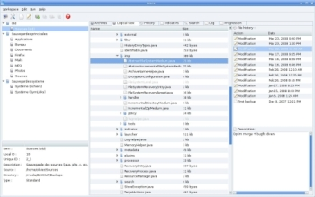

# Areca Backup - Features

| About Areca                   | End user documentation            | Technical informations                        |
|-------------------------------|-----------------------------------|-----------------------------------------------|
| [Home](README.md)             | [Plugins](plugin_list.md)         | [Regular expressions](regex.md)               |
| [Features](features.md)       | [Versions history](history.md)    | [Translations](documentation.md#translations) |
| [Plugins](plugin_list.md)     | [Tutorial](tutorial.md)           | [Config backup](config_backup.md)             |
| [Screenshots](screenshots.md) | [User's manual](documentation.md) |                                               |
| [Download]                    | [FAQ](faq.md)                     |                                               |
| [Bug & feature requests]      | [Support & Contact](support.md)   |                                               |
| [Forums]                      |                                   |                                               |

[Download]: https://sourceforge.net/projects/areca/files/areca-stable/
[Bug & feature requests]: https://sourceforge.net/p/areca/_list/tickets?source=navbar
[Forums]: https://sourceforge.net/projects/areca/forums

> Areca Backup is a personal file backup software.
>
> It is released under the [General Public License](http://www.opensource.org/licenses/gpl-license.php) (GPL) v2.

## Backup Engine Features :

- Archives **compression** (Zip & Zip64 format)
- Archives **encryption** (AES128 & AES256 encryption algorithms)
- Storage on local hard drive, network drive, USB key, FTP, FTPs (with implicit and explicit SSL / TLS) or SFTP server
- Source file **filters** (by extension, subdirectory, regular expression, size, date, status, with AND/OR/NOT logical operators)
- Incremental, differential and full backup support
- Support for **delta backup** (store only modified **parts** of your files)
- Archives merges : You can merge contiguous archives into one single archive to save storage space.
- As of date recovery : Areca allows you to recover your archives (or single files) as of a specific date.
- **Transaction mechanism** : All critical processes (such as backups or merges) are transactional. This guarantees your backups' integrity.
- Backup reports : Areca generates backup reports that can be stored on your disk or sent by **email**.
- Post backup scripts : Areca can launch **shell scripts** after backup.
- Files permissions, symbolic links and named pipes can be stored and recovered. (Linux only)

## Graphical User Interface :

- Archives content **explorer**. (including a 'find file in archives' feature)
- Archive description : A manifest is associated to each archive, which contains various informations such as title, date, description, and additional technical data.
- **File version tracking** : Areca keeps track of your files' history (creation / modifications / deletion). Each version can be selectively viewed and recovered.
- Backup **simulation** (check whether a backup is necessary)
- User's actions history : Areca keeps an history of all user's actions (archives deletion, merges, backups, recoveries).

## Command-Line Interface :

- Areca comes with a command-line interface which can be used for backup automation.

---

[Top] | [Copyright (c) 2005-2015 Olivier PETRUCCI] | [archive.org]

[Top]: #areca-backup---features "Go to top of the document"
[Copyright (c) 2005-2015 Olivier PETRUCCI]: https://areca-backup.org/features.php "Visit the original resource"
[archive.org]: http://web.archive.org/web/20150912034048/http://www.areca-backup.org/features.php "Visit the original resource at archive.org"