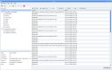
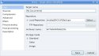

# Areca Backup - Screenshots

| About Areca                   | End user documentation            | Technical informations                        |
|-------------------------------|-----------------------------------|-----------------------------------------------|
| [Home](README.md)             | [Plugins](plugin_list.md)         | [Regular expressions](regex.md)               |
| [Features](features.md)       | [Versions history](history.md)    | [Translations](documentation.md#translations) |
| [Plugins](plugin_list.md)     | [Tutorial](tutorial.md)           |                                               |
| [Screenshots](screenshots.md) | [User's manual](documentation.md) |                                               |
| [Download]                    | [FAQ](faq.md)                     |                                               |
| [Bug & feature requests]      | [Support & Contact](support.md)   |                                               |
| [Forums]                      |                                   |                                               |

[Download]: https://sourceforge.net/projects/areca/files/areca-stable/
[Bug & feature requests]: https://sourceforge.net/p/areca/_list/tickets?source=navbar
[Forums]: https://sourceforge.net/projects/areca/forums

> Areca's user interface ...

|    |    |    |    |
|:----------------------------------------------------------------------:|:------------------------------------------------------------------------:|:---------------------------------------------------:|:-----------------------------------------------------------:|
| [Main screen (Logical view)](./images/linux/original/logical_view.jpg) | [Main screen (Physical view)](./images/linux/original/physical_view.jpg) | [Search screen](./images/linux/original/search.jpg) | [User actions history](./images/linux/original/history.jpg) |
 

|    |    |    |    |
|:----------------------------------------------------------------:|:----------------------------------------------------------------------:|:------------------------------------------------------------------------------:|:------------------------------------------------------------------------:|
| [Target edition (Main)](./images/linux/original/target_main.jpg) | [Target edition (Sources)](./images/linux/original/target_sources.jpg) | [Target edition (Compression)](./images/linux/original/target_compression.jpg) | [Target edition (Advanced)](./images/linux/original/target_advanced.jpg) |

|    |    |     |    |
|:----------------------------------------------------------------------:|:-----------------------------------------------------------------------------:|:---------------------------------------------------:|:--------------------------------------------------:|
| [Target edition (Filters)](./images/linux/original/target_filters.jpg) | [Target edition (Actions)](./images/linux/original/target_postprocessors.jpg) | [FTP (main)](./images/linux/original/ftp_main.jpg)  | [FTP (FTPs)](./images/linux/original/ftp_ftps.jpg) |

|    |    |    |    |
|:------------------------------------------------------------------:|:----------------------------------------------------------------------------:|:----------------------------------------------------------------------:|:------------------------------------------------------------------:|
| [Email report parameterization](./images/linux/original/email.jpg) | [Archive detail (Properties)](./images/linux/original/detail_properties.jpg) | [Archive detail (Content)](./images/linux/original/detail_content.jpg) | [Backup simulation screen](./images/linux/original/simulation.jpg) |

|    |    |    |    |
|:---------------------------------------------------:|:-----------------------------------------------------------------------------:|:-----------------------------------------------------------------------:|:-------------------------------------------------------------------------:|
| [Backup screen](./images/linux/original/backup.jpg) | [User preferences (Appearance)](./images/linux/original/prefs_appareance.jpg) | [User preferences (Startup)](./images/linux/original/prefs_startup.jpg) | [User preferences (Archives)](./images/linux/original/prefs_archives.jpg) |

---

[Top] | [Copyright (c) 2005-2015 Olivier PETRUCCI]

[Top]: #areca-backup---screenshots "Go to top of the document"
[Copyright (c) 2005-2015 Olivier PETRUCCI]: https://areca-backup.org/screenshots.php "Visit the original resource"