# Areca Backup - Tutorial: Configuring your first target

| About Areca                   | End user documentation            | Technical informations                        |
|-------------------------------|-----------------------------------|-----------------------------------------------|
| [Home](README.md)             | [Plugins](plugin_list.md)         | [Regular expressions](regex.md)               |
| [Features](features.md)       | [Versions history](history.md)    | [Translations](documentation.md#translations) |
| [Plugins](plugin_list.md)     | [Tutorial](tutorial.md)           |                                               |
| [Screenshots](screenshots.md) | [User's manual](documentation.md) |                                               |
| [Download]                    | [FAQ](faq.md)                     |                                               |
| [Bug & feature requests]      | [Support & Contact](support.md)   |                                               |
| [Forums]                      |                                   |                                               |

[Download]: https://sourceforge.net/projects/areca/files/areca-stable/
[Bug & feature requests]: https://sourceforge.net/p/areca/_list/tickets?source=navbar
[Forums]: https://sourceforge.net/projects/areca/forums

> This short tutorial will show you how to configure your first target.
>
> Have a look at the "User's Manual" section for more informations.

"[Tutorial](tutorial.md)" section

It is assumed that you've installed Areca using the default procedure of your system (Linux or Windows).

## Before starting

### Configuration directory

Areca will need a directory where it will store the configuration of your backups (what files to backup, where to store them, which files types must be filtered, whether the backups are compressed or encrypted, and so on). This "configuration directory" is called a "workspace".

In this tutorial, I assume that your workspace is "/home/olivier/areca_workspace".

### Backup directory

Areca will also need a directory (on your local hard drive or a USB drive, for instance) where to store your archives. This directory will be refered as "Backup directory". I assume in this tutorial that your backup directory is "/backups".

## Launching Areca

Simply run the "areca.sh" script (on Linux) or "areca.exe" (on Windows) ... A new window like this one should appear :

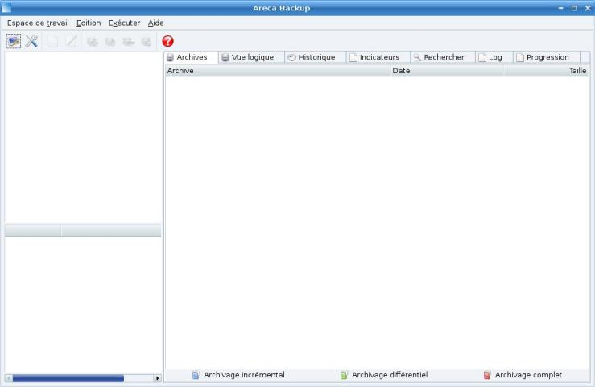

This is the main interface of Areca Backup.

## Choosing your workspace

As said before, we want to store our configuration in "/home/olivier/areca_workspace", so go to the "Workspace" menu, choose "Open Workspace" and select "/home/olivier/areca_workspace".

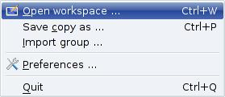

## Creating your first group

You can create multiple backup configurations in Areca. For instance you can create a first configuration that backups your MP3 without compression, and another one that backups your documents with compression and encryption.

Areca allows you to group your configurations so they will be easier to manage.

To create your first group, go to the "Edit" menu and select "New Group".

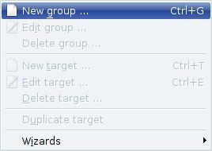

A new window will appear, asking for a group name and description. Enter "My First Backup Group" as group name.

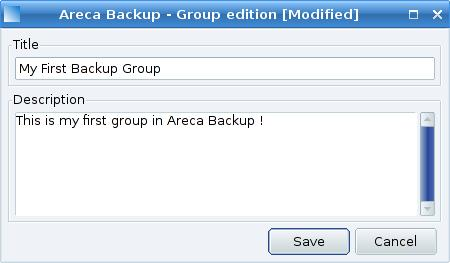

... and click the "Save" button.

Your new group magically appears in the main window :

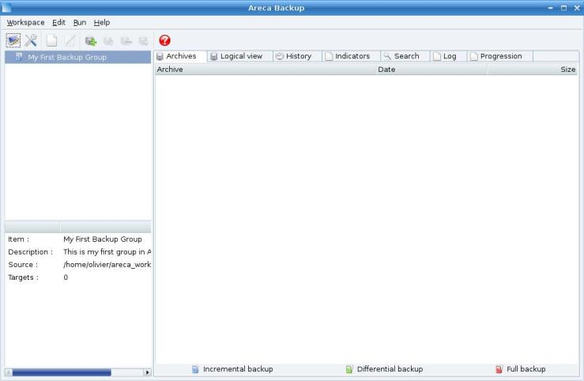

## Creating your first target

A backup configuration is called "target" in Areca. To create your first target, select "My First Backup Group", go to the "Edit" menu, and select the "New Target" item :

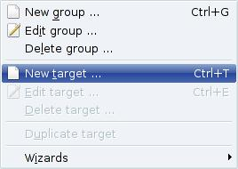

A new screen appears ...

## Target configuration

### "Main" Tab

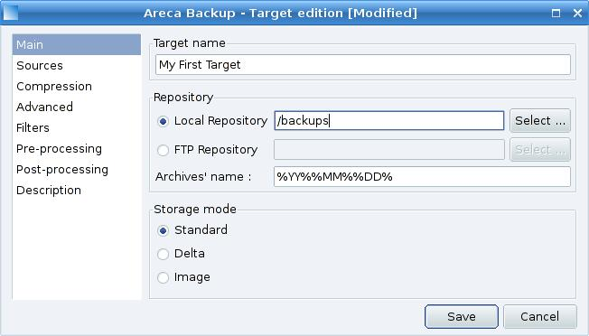

Enter "My First Target" as target name, and select your backup directory (which will be - as discussed at the beginning of this tutorial - "/backups").

Keep all other fields unchanged and go to the "Sources" tab ...

### "Sources" Tab

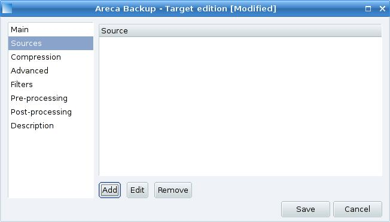

This tab allows you to select the directories you want to backup.

Click the "Add" Button, and select a directory (for instance : "/home/olivier/Photos")

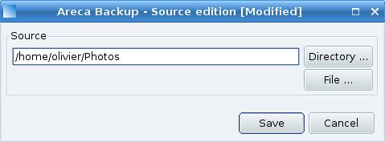

Click on the "Save" Button. "/home/olivier/Photos" appears in the "sources" list :

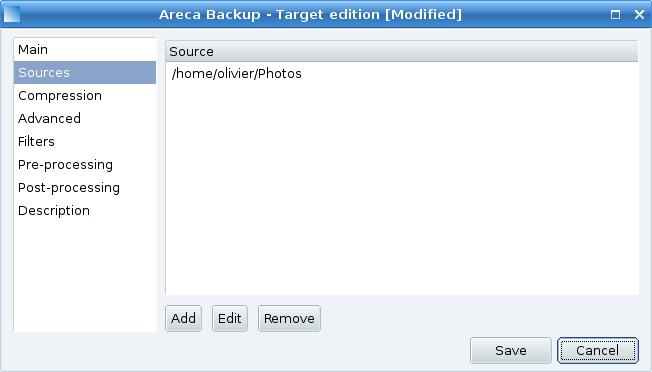

Add as many source directories as you want, and go to the "Compression" tab.

### "Compression" Tab

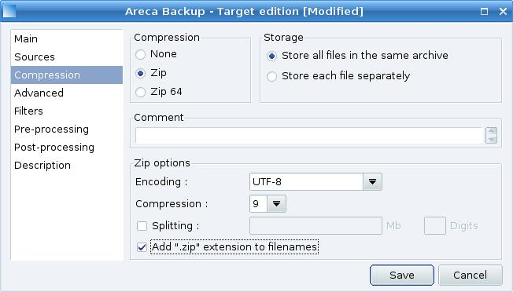

This window allows you to select whether your archive will be compressed or not (and how it will be compressed).

In our case, we just want to create standard zip files, so keep the default settings, and simply check the "add .zip extension to filenames" checkbox.

Once you're done, go to the "Advanced" tab ...

### "Advanced" Tab

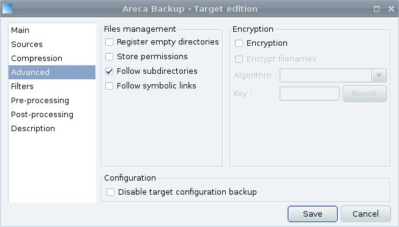

This window allows you to choose advanced parameters such as permission management (on Linux) or encryption.

In our case, we don't want encryption, so keep the default configuration and go to the "filters" tab.

### "Filters" Tab

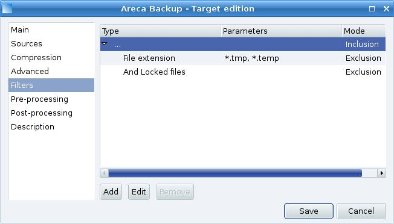

Filters allow you to exclude unwanted files or directories from your backup.

By default, Areca excludes "*.tmp" and "*.temp" files as well as locked files.

If you want to add a new filter (for instance to exclude the "/home/olivier/Photos/old" subdirectory), select the "..." filter item and click the "Add" button :

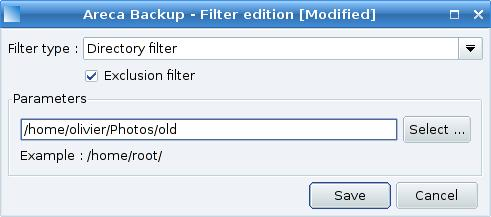

Select "Directory filter" as filter type, choose "/home/olivier/Photos/old" as directory and click the "Save" button.

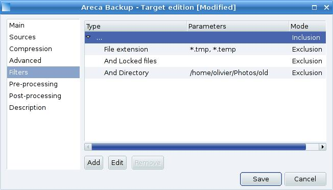

Go to the "pre-processing" tab.

### "Pre-processing" Tab

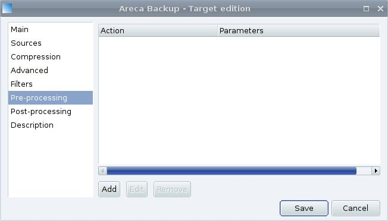

This tab allows you to define tasks that will be performed by Areca before each Backup.

We don't want any pre-processing, so go directly to the "post-processing" tab.

### "Post-processing" Tab

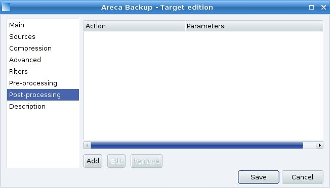

We want Areca to send an email to "admin@mycorp.com", using the SMTP server "smtp.mycorp.com" after each backup.

To do that, click the "Add" button, and select "Send the report by email".

Fill the "Title", "Recipients", "From" and "SMTP server" fields as shown bellow :

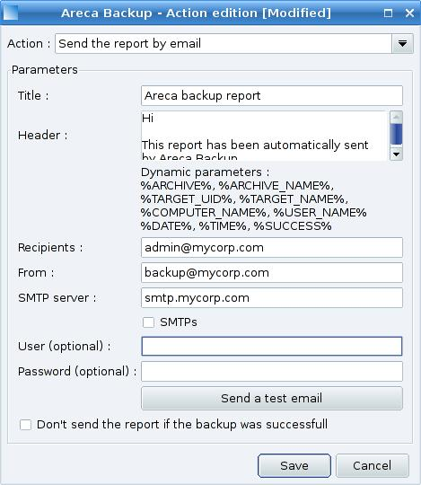

... and click the "Save" button.

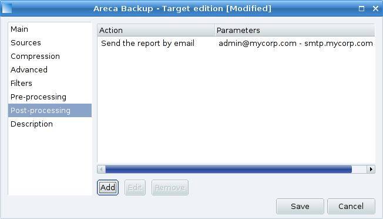

Go to the "Description" tab.

### "Description" Tab

Enter whatever you want : it's just for information purpose.

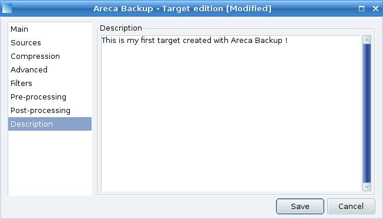

Once you're done, hit the "Save" button. That's it ! You've created your first target with Areca Backup !

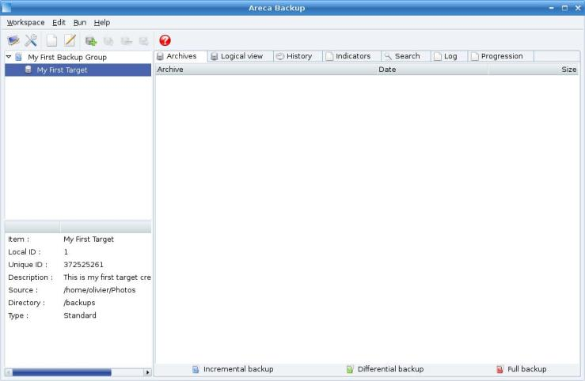

## Next step ...

Step 2 : [Running your first backup](tutorial2.md)

---

[Top] | [Copyright (c) 2005-2015 Olivier PETRUCCI]

[Top]: #areca-backup---tutorial-configuring-your-first-target "Go to top of the document"
[Copyright (c) 2005-2015 Olivier PETRUCCI]: https://areca-backup.org/tutorial1.php "Visit the original resource"