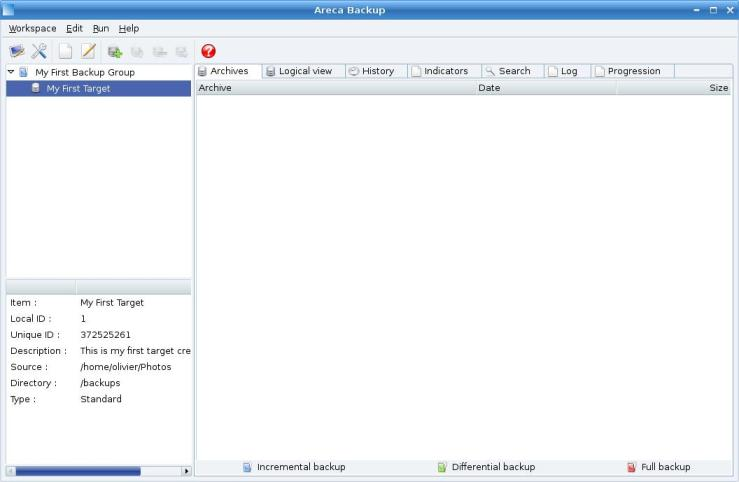

# Areca Backup - Tutorial: Running your first backup

| About Areca                   | End user documentation            | Technical informations                        |
|-------------------------------|-----------------------------------|-----------------------------------------------|
| [Home](README.md)             | [Plugins](plugin_list.md)         | [Regular expressions](regex.md)               |
| [Features](features.md)       | [Versions history](history.md)    | [Translations](documentation.md#translations) |
| [Plugins](plugin_list.md)     | [Tutorial](tutorial.md)           | [Config backup](config_backup.md)             |
| [Screenshots](screenshots.md) | [User's manual](documentation.md) |                                               |
| [Download]                    | [FAQ](faq.md)                     |                                               |
| [Bug & feature requests]      | [Support & Contact](support.md)   |                                               |
| [Forums]                      |                                   |                                               |

[Download]: https://sourceforge.net/projects/areca/files/areca-stable/
[Bug & feature requests]: https://sourceforge.net/p/areca/_list/tickets?source=navbar
[Forums]: https://sourceforge.net/projects/areca/forums

> This short tutorial will show you how to run your first target.
>
> Make sure you've had a look at the previous tutorial before reading this section.
>
> You can also have a look at the "User's Manual" section for more informations.

"[Tutorial](tutorial.md)" section

## Before starting

It is assumed that you've installed Areca using the default procedure of your system (Linux or Windows).
Make sure you've had a look at the previous tutorial (Section 1 : "[Configuring your first target](tutorial1.md)") before reading this section.

## Launching your first backup

Once your target has been created (see tutorial section 1 : "[Configuring your first target](tutorial1.md)"), you can run it as frequently as you want : select your target in the left side of the main window :

... right click and and hit the "Backup" item in the menu that appears.

A new window appears and asks some (optional) informations about the backup that will be performed :

We want to provide a short description for this first backup, so select the "Add manifest" checkbox and enter "This is my first archive !" as title.

Once you're done, hit the "Start Backup" button : the window closes and a progress bar appears in the main window :

## Viewing your archive

Once the backup is completed, your new archive appears in the "Physical view" tab ... that's it : you've created your first archive with Areca Backup !

You can see the content of your archive by double-clicking on it :

## Performing another backup

Let's suppose that you add a new picture (named "MyNewPicture.jpg") in your directory. If you want to backup this new file, all you have to do is to select your target again, right click and select "Backup" again (as shown previously)

Enter "Another archive !" as archive title and hit "Start Backup"

Once the backup is finished, you can notice that another row appears in your "Physical view" tab. This is your new archive.

Double-click on it to see its content :

You can notice that it only contains the new file (all other files are greyed). This is called "Incremental backup" : Areca only stores new or modified files.

## Viewing a file's history

Let's assume that the new picture ("MyNewPicture.jpg") has been modified and that a third backup has been performed :

Go the "Logical view" tab :
If you select the "MyNewPicture.jpg" item, you can see its history on the right side of the tab.

In this example, you see that the file was created at 9:50 PM and modified at 9:54 PM.

## Next step ...

Step 3 : [Recovering files from your archives](tutorial3.md)

---

[Top] | [Copyright (c) 2005-2015 Olivier PETRUCCI]

[Top]: #areca-backup---tutorial-running-your-first-backup "Go to top of the document"
[Copyright (c) 2005-2015 Olivier PETRUCCI]: https://areca-backup.org/tutorial2.php "Visit the original resource"