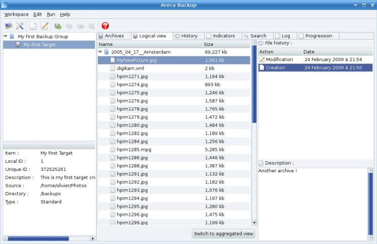
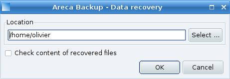
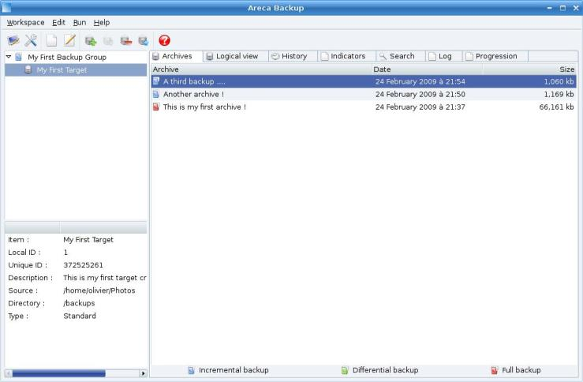
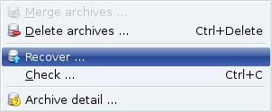
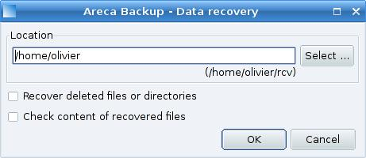

# Areca Backup - Tutorial: Recovering files from your archives

| About Areca                   | End user documentation            | Technical informations                        |
|-------------------------------|-----------------------------------|-----------------------------------------------|
| [Home](README.md)             | [Plugins](plugin_list.md)         | [Regular expressions](regex.md)               |
| [Features](features.md)       | [Versions history](history.md)    | [Translations](documentation.md#translations) |
| [Plugins](plugin_list.md)     | [Tutorial](tutorial.md)           | [Config backup](config_backup.md)             |
| [Screenshots](screenshots.md) | [User's manual](documentation.md) |                                               |
| [Download]                    | [FAQ](faq.md)                     |                                               |
| [Bug & feature requests]      | [Support & Contact](support.md)   |                                               |
| [Forums]                      |                                   |                                               |

[Download]: https://sourceforge.net/projects/areca/files/areca-stable/
[Bug & feature requests]: https://sourceforge.net/p/areca/_list/tickets?source=navbar
[Forums]: https://sourceforge.net/projects/areca/forums

> This short tutorial will show you how to recover files from your archives.
>
> Make sure you've had a look at the previous tutorials before reading this section.
>
> You can also have a look at the "User's Manual" section for more informations.

"[Tutorial](tutorial.md)" section

## Before starting

It is assumed that you've installed Areca using the default procedure of your system (Linux or Windows).

Make sure you've had a look at the previous tutorial (Section 2 : "[Running your first backup](tutorial2.md)") before reading this section.

## Recovering a specific version of a specific file

Let's assume that you want to recover the very first version of "MyNewPicture.jpg" (see image below and tutorial section 2 : "[Running your first backup](tutorial2.md)").

Select it in the history (on the right side of the "Logical view" tab), right click and select "Recover ...".

A new window appears and asks you where to recover the file.

Enter the destination (for instance "/home/olivier") and hit "OK".
That's it : your file has been recovered in "/home/olivier".

## Recovering a whole archive

If you want to recover the whole archive, go back to the "Physical view" and select the last archive :

Right-click and select "Recover..."

As previously, a new window appears and asks where to recover the selected archive. Enter the destination (for instance "/home/olivier") and hit "OK".

Note that in this case, Areca will recover your archive in a "rcv" subdirectory (in this example : "/home/olivier/rcv").

You can also notice that Areca recovers the "MyNewPicture.jpg" file that is contained in your third archive, but also the files stored in your previous archives : you don't have to recover your data archive-by-archive.

## Next step ...

Step 4 : [Merging your archives](tutorial4.md)

---

[Top] | [Copyright (c) 2005-2015 Olivier PETRUCCI]

[Top]: #areca-backup---tutorial-recovering-files-from-your-archives "Go to top of the document"
[Copyright (c) 2005-2015 Olivier PETRUCCI]: https://areca-backup.org/tutorial3.php "Visit the original resource"