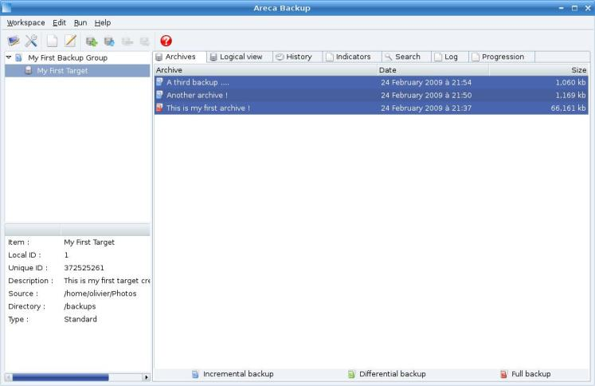
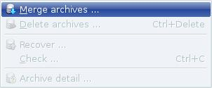
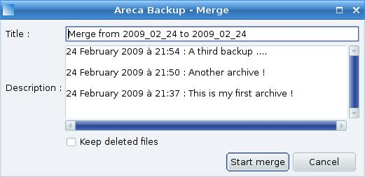
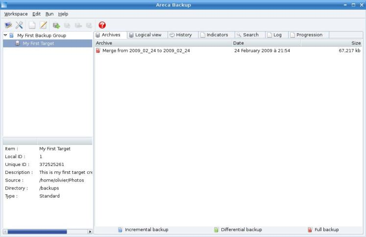
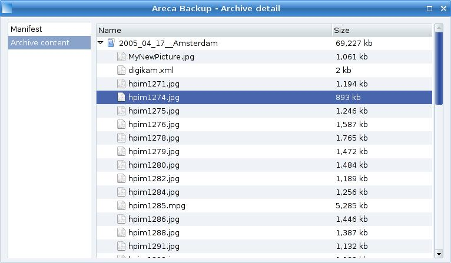
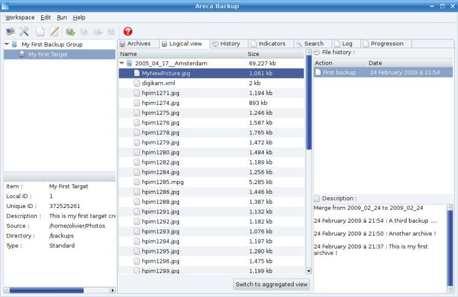

# Areca Backup - Tutorial: Merging your archives

| About Areca                   | End user documentation            | Technical informations                        |
|-------------------------------|-----------------------------------|-----------------------------------------------|
| [Home](README.md)             | [Plugins](plugin_list.md)         | [Regular expressions](regex.md)               |
| [Features](features.md)       | [Versions history](history.md)    | [Translations](documentation.md#translations) |
| [Plugins](plugin_list.md)     | [Tutorial](tutorial.md)           |                                               |
| [Screenshots](screenshots.md) | [User's manual](documentation.md) |                                               |
| [Download]                    | [FAQ](faq.md)                     |                                               |
| [Bug & feature requests]      | [Support & Contact](support.md)   |                                               |
| [Forums]                      |                                   |                                               |

[Download]: https://sourceforge.net/projects/areca/files/areca-stable/
[Bug & feature requests]: https://sourceforge.net/p/areca/_list/tickets?source=navbar
[Forums]: https://sourceforge.net/projects/areca/forums

> This short tutorial will show you how to use the "merge" feature of Areca.
>
> Make sure you've had a look at the previous tutorials before reading this section.
>
> You can also have a look at the "User's Manual" section for more informations. 	"Tutorial" section

"[Tutorial](tutorial.md)" section

## Before starting

It is assumed that you've installed Areca using the default procedure of your system (Linux or Windows).

Make sure you've had a look at the previous tutorial (Section 3 : "[Merging your archives](tutorial3.md)") before reading this section.

## Merging archives

If you want to keep only a limited number of archives to avoid using too much space on your backup location, the "merge" feature will be useful to you.

Go to the "Physical view" and select your three archives :

Right-click and select the "Merge" menu item :

A new window appears :

Just hit the "Start merge" button.
Once the merge is performed, you can notice that only one archive appears in the "Physical view" :

Double-click on it to see its content : you can notice that all files (including "MyNewPicture.jpg") are contained in this unique archive :

If you go back to the "Logical view" and select "MyNewPicture.jpg", you see that the file's history has disappeared. A unique version is now displayed (created at 9:54 PM) : Areca has destroyed the file's history and kept the last version only.

## Next step ...

Step 5 : [Recovering files when your backup configuration has been lost](tutorial5.md)

---

[Top] | [Copyright (c) 2005-2015 Olivier PETRUCCI]

[Top]: #areca-backup---tutorial-merging-your-archives "Go to top of the document"
[Copyright (c) 2005-2015 Olivier PETRUCCI]: https://areca-backup.org/tutorial4.php "Visit the original resource"