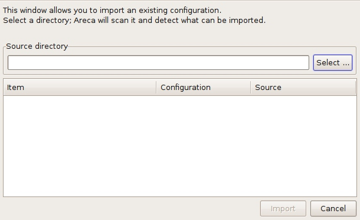

# Areca Backup - Tutorial: Recovering files when your backup configuration has been lost

| About Areca                   | End user documentation            | Technical informations                        |
|-------------------------------|-----------------------------------|-----------------------------------------------|
| [Home](README.md)             | [Plugins](plugin_list.md)         | [Regular expressions](regex.md)               |
| [Features](features.md)       | [Versions history](history.md)    | [Translations](documentation.md#translations) |
| [Plugins](plugin_list.md)     | [Tutorial](tutorial.md)           | [Config backup](config_backup.md)             |
| [Screenshots](screenshots.md) | [User's manual](documentation.md) |                                               |
| [Download]                    | [FAQ](faq.md)                     |                                               |
| [Bug & feature requests]      | [Support & Contact](support.md)   |                                               |
| [Forums]                      |                                   |                                               |

[Download]: https://sourceforge.net/projects/areca/files/areca-stable/
[Bug & feature requests]: https://sourceforge.net/p/areca/_list/tickets?source=navbar
[Forums]: https://sourceforge.net/projects/areca/forums

> This short tutorial will show you how to recover your data when your backup configuration has been lost (for instance in case of disk crash).
>
> Make sure you've had a look at the previous tutorials before reading this section.
>
> You can also have a look at the "User's Manual" section for more informations.

"[Tutorial](tutorial.md)" section

## Before starting

It is assumed that you've installed Areca using the default procedure of your system (Linux or Windows).

Make sure you've had a look at sections 2 ("[Running your first backup](tutorial2.md)") and 3 ("[Recovering files from your archives](tutorial3.md)") before reading this section.

## Recovering after a complete crash

If all your local data (including Areca's configuration) has been lost, you must recover your target configuration before being able to read and restore your archives.

Areca stores a copy of your target configuration in a subdirectory of your backup location named "areca_config_backup". So all you have to do is to import this configuration copy into your workspace.

Let's see how to do this :

First of all, launch Areca (you can open a specific workspace or leave the default one, which will be empty because all your configuration has been lost)

Go to the "Workspace" menu and click on the "Import" item ... the following window appears :

Let's assume that all your backups are stored in a directory named "/home/olivier/Bureau/backup". If you kept the "store backup configuration" option enabled in your target configuration, there should be a subdirectory named "areca_config_backup" in that directory.

That's where we'll ask Areca to look for configurations to import :

Areca will list all configurations that have been found. In our case, there is only one configuration copy in this subdirectory.
Select it and click on the "Import" button.

Your target configuration copy is imported into your workspace, and can now be used to recover your files, using Areca's standard recovery features (see tutorial section 3 : [Recovering files from your archives](tutorial3.md))

## What if my target are encrypted ?

When your targets are encrypted, Areca doesn't store your password in your configuration copy (for obvious security reasons : we don't want anybody to be able to retrieve this password from your configuration copy).

That's why a specific window will open during the "import" phase, which will ask you to enter your password.

Of course, nothing can be done if you forgot your password : Areca won't be able to read and recover your archives.

---

[Top] | [Copyright (c) 2005-2015 Olivier PETRUCCI]

[Top]: #areca-backup---tutorial-recovering-files-when-your-backup-configuration-has-been-lost "Go to top of the document"
[Copyright (c) 2005-2015 Olivier PETRUCCI]: https://areca-backup.org/tutorial5.php "Visit the original resource"