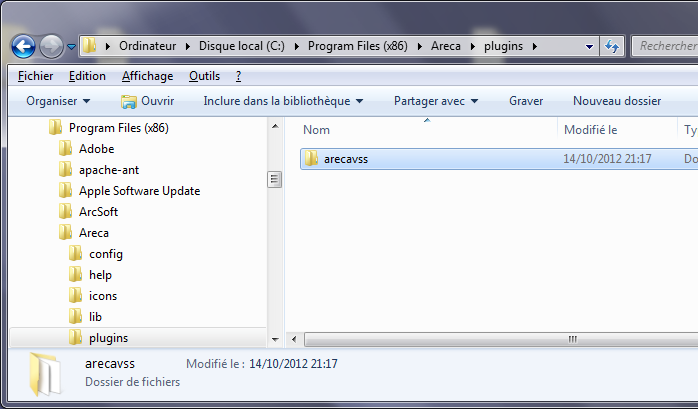

# ArecaVSS - The Volume Shadow Copy plugin for Areca-Backup

|                                                         | Tickets :                               |
|---------------------------------------------------------|-----------------------------------------|
| [Home](README.md)                                       | [Bugs](bugs.md)                         |
| [Download ArecaVSS](download.md)                        | [Feature requests](feature-requests.md) |
| [Get a license for ArecaVSS (free or full)](license.md) | [Open discussion](open-discussion.md)   |
| [Frequently Asked Questions (FAQ)](faq.md)              |                                         |

## What is ArecaVSS

ArecaVSS is a plugin for the open source backup software Areca Backup ([www.areca-backup.org](../areca-backup.org/README.md)). It allows Areca-Backup to use Microsoft's Volume Shadow Copy service for backing up files that are locked by the system. (for instance outlook files)

## Compatibility

ArecaVSS requires Areca-Backup v7.2.13 or later and Windows Server 2003, 2008, Vista, 7 or later to operate properly. Due to specificities on the Volume Shadow Copy implementation for Windows XP, it won't operate on this system or earlier versions of Windows.

## Installation and usage

First, download ArecaVSS from [here](download.md) and unzip it in the "plugins" subdirectory of Areca-Backup. You should have a subdirectory named "arecavss".

Once done, get a free license of ArecaVSS [here](license.md) and copy it in the ArecaVSS directory. This license will be limited in time (2 days) but will allow you to test ArecaVSS on your computer without purchasing a full license.

Once you are totally sure that ArecaVSS works properly on your system, get a full license [here](license.md) and replace your free license by this new full license.

## Contact and support

Please use ArecaVSS' dedicated pages to submit [bugs](bugs.md) and [feature requests](feature-requests.md).

You can post general questions about ArecaVSS [here](open-discussion.md).

If needed, you can also contact us by sending an email to admin [at] arecavss [dot] com. 

---

[Top] | [Copyright (c) Olivier PETRUCCI]

[Top]: #arecavss---the-volume-shadow-copy-plugin-for-areca-backup "Go to top of the document"
[Copyright (c) Olivier PETRUCCI]: http://web.archive.org/web/20190623072603/http://www.arecavss.com/index.php?PHPSESSID=b7a25355db98fa9b1c290eb892b036e1 "Visit the original resource"