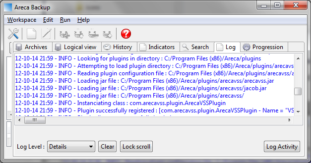

# ArecaVSS - The Volume Shadow Copy plugin for Areca-Backup

|                                                         | Tickets :                               |
|---------------------------------------------------------|-----------------------------------------|
| [Home](README.md)                                       | [Bugs](bugs.md)                         |
| [Download ArecaVSS](download.md)                        | [Feature requests](feature-requests.md) |
| [Get a license for ArecaVSS (free or full)](license.md) | [Open discussion](open-discussion.md)   |
| [Frequently Asked Questions (FAQ)](faq.md)              |                                         |

The last version of ArecaVSS can be downloaded from here :

| [ArecaVSS-v2.3-jre32]()                 | [ArecaVSS-v2.3-jre64]()                 |
|:---------------------------------------:|:---------------------------------------:|
| (for 32-bits Java Runtime Environments) | (for 64-bits Java Runtime Environments) |

Once your download is completed, don't forget to
[get a license (free or full)]()

[Previous versions of ArecaVSS >>]()

## IMPORTANT :

- Don't forget to get a license (free or full) [here]()
- When using ArecaVSS, make sure that you are using a Java Runtime Environment that has the same architecture as your OS (32-bits JVM on 32-bits Windows / 64-bits JVM on 64-bits Windows)
- Areca-Backup must be run with administrator rights to invoke Volume Shadow Copy Services. 

## Installation :

Once downloaded, unzip the file in the "plugins" subdirectory of Areca-Backup (something like "_C:\Program Files (x86)\Areca\plugins_" or "_C:\Program Files\Areca\plugins_" depending on your system and on where you installed Areca). You should have a subdirectory named "arecavss".

That's all ! Launch Areca-Backup and check that the plugin is properly detected in the "log" tab. You should have a "Volume Shadow Copy" tab in the target edition window.

---

[Top] | [Copyright (c) Olivier PETRUCCI]

[Top]: #arecavss---the-volume-shadow-copy-plugin-for-areca-backup "Go to top of the document"
[Copyright (c) Olivier PETRUCCI]: http://web.archive.org/web/20190623074611/http://www.arecavss.com/download.php?PHPSESSID=b7a25355db98fa9b1c290eb892b036e1 "Visit the original resource"