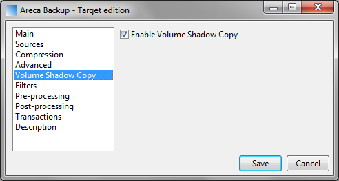
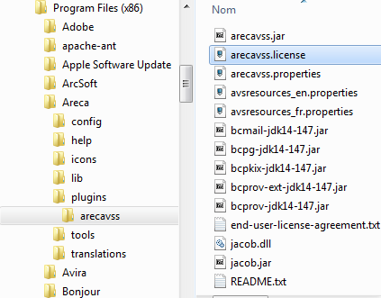

# ArecaVSS - The Volume Shadow Copy plugin for Areca-Backup

|                                                         | Tickets :                               |
|---------------------------------------------------------|-----------------------------------------|
| [Home](README.md)                                       | [Bugs](bugs.md)                         |
| [Download ArecaVSS](download.md)                        | [Feature requests](feature-requests.md) |
| [Get a license for ArecaVSS (free or full)](license.md) | [Open discussion](open-discussion.md)   |
| [Frequently Asked Questions (FAQ)](faq.md)              |                                         |

## How does ArecaVSS work ?

ArecaVSS interacts with the Volume Shadow Copy Services on Windows to create a Volume snapshot at the beginning of the backup process. Once the snapshot is completed, it is used by Areca-Backup as reference for the backup. This allows Areca to interact with files that are opened or locked by the system or other programs running on your computer (like Outlook, Excel, database engines, ...).

When Areca shuts down, this snapshot is simply removed from the computer.

See [this article on Wikipedia](https://www.wikipedia.org/wiki/Shadow_Copy) for more details about VSS on Microsoft Windows.

## Which versions of Windows does ArecaVSS support ?

ArecaVSS has been successfully tested on Windows Server 2003, Windows Server 2008, Windows Vista and Windows 7. It does not currently support Windows XP.

## I want to install ArecaVSS on multiple computers. How many licenses shall I purchase ?

You have to purchase one license (4. EUR) per computer.

## OK, I installed ArecaVSS and got a license file ... now how to I enable VSS on my backup configuration in Areca ?

Launch Areca-Backup and double-click on your target to open the target configuration window.

If ArecaVSS has been successfully installed, there will be a tab named "Volume Shadow Copy" ; select this tab and check the "Enable Volume Shadow Copy" checkbox.

Then, click on the "Save" button to save your modifications.

... That's all !

## I get the following error when trying to perform a backup with VSS enabled : "Invalid ArecaVSS license : Invalid license type : 0"

This is because ArecaVSS can't find your license file. Please ensure that you have a valid license for ArecaVSS (free or full).

Your license file can be downloaded [here](license.md). It must be named "arecavss.license" and must be located in the "plugins/arecavss" subdirectory of Areca-Backup (for instance : "C:\Program Files (x86)\Areca\plugins\arecavss")

## I get the following message when running Areca with ArecaVSS enabled : "It seems that you are running 32-bits Java on a 64-bits system" ... what's wrong ?

In order to properly invoke Volume Shadow Copy services, the version of your Java Runtime Environment (JRE) must be the same as your system's : 32-bit systems must run 32-bit JREs (and the 32-bit version of ArecaVSS), and 64-bit systems must run 64-bit JREs (and the 64 bit version of ArecaVSS).

Most of the time, this error occurs on 64 bit systems on which a 32-bit version of Java has been installed. If it is the case, uninstall the 32-bit version of Java and install a 64-bit version instead.

If you keep getting this message although you have installed 64-bit Java, it is likely that you have *also* a 32-bit Java installed somewhere else on your computer, which is used by Areca. To check this, simply launch Areca, open the "Help" -> "About" window, go to the "System" tab and check the value of the "os.arch" property. If it is "x86", you are indeed running a 32 bit version of Java. To get the directory in which this version is installed, see the "java.home" property.

## Shadow copies don't seem to work on network drives ... what's the problem ?

You need a special setup to create volume shadow copies on mapped network drives; in most cases, shadow copies will be created only for local hard drives.

See [this link on Microsoft's website](https://technet.microsoft.com/en-us/library/jj612865.aspx) for more informations about the requirements when creating shadow copies of network shares.

## Shadow copies don't seem to work on TrueCrypt volumes ... what's the problem ?

VSS is supported by TrueCrypt only in very specific cases. See [this page on TrueCrypt's website](http://www.truecrypt.org/docs/issues-and-limitations) for more informations on limitations of TrueCrypt volumes when handling Volume Shadow Copies.

## I get the following error when trying to perform a backup with VSS enabled : "Volume (<u>_volume name_</u>) does not support Volume Shadow Copy. VSS is only supported by NTFS filesystems."

ArecaVSS uses persistent volume shadow copies, which require the target drive to use NTFS. It won't work with other filesystems (for instance FAT32)

## I get the following error when trying to perform a backup with VSS enabled : "com.jacob.com.ComFailException: IEnumVARIANT::Next"

This error can have multiple rootcauses. Most of the times, it occurs because you didn't start Areca-Backup as Administrator (ArecaVSS needs administrator permissions to communicate with the Volume Shadow Copy Services on Microsoft Windows).

It may also happen if you use ArecaVSS on Windows XP (which is currently not supported)

Check the "log" tab in Areca-Backup or Areca's log file. You should find additional informations to help you understand the issue.

## The Volume Shadow Copy is successfully created; however, I get error messages in Areca-Backup telling me that some files are still locked by another process when trying to perform the backup. Is it a bug ?

The Volume Shadow Copy mechanism implemented in Windows may exclude some files from the snapshot (for instance some log files that change very often and are not considered important to the system). This means that those files may still be locked by other processes, even if the shadow copy went successfully.

If those files are not important to you, you can simply exclude them by using the file filtering mechanism provided by Areca-Backup.

You can also modify Windows' VSS parameterization to take them into account. (see for instance [this page on MSDN](https://msdn.microsoft.com/en-us/library/windows/desktop/aa819132%28v=vs.85%29.aspx))

---

[Top] | [Copyright (c) Olivier PETRUCCI]

[Top]: #arecavss---the-volume-shadow-copy-plugin-for-areca-backup "Go to top of the document"
[Copyright (c) Olivier PETRUCCI]: http://web.archive.org/web/20190623074440/http://www.arecavss.com/faq.php?PHPSESSID=b7a25355db98fa9b1c290eb892b036e1 "Visit the original resource"